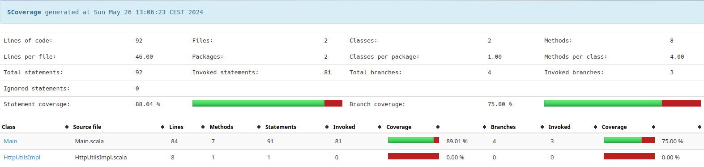

[Google Slides for this project](https://docs.google.com/presentation/d/1oQS_NJ7TLg6Beny7evHeEdxto1foAqiKCFrnaiIV4sY/edit?usp=sharing "Google Slides for this project")

## Code Coverage Report

Overview :
- Lines of code: 92
- Files: 2
- Classes: 2
- Methods: 8
- Statement coverage: 88.04%
- Branch coverage: 75.00%

